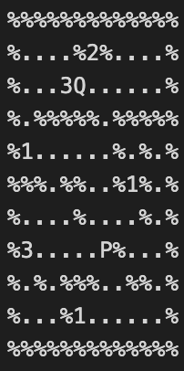

# The Pacman Game

## Introduction

One is likely familiar with the game Pacman, where a player attempts to consume fruits and avoid ghosts. The repository implement a slightly modified version of the pacman game. This version involves the elimination of ghosts and the inclusion of a second Pacman agent. Hereinafter, these two Pacman entities shall be referred to as agents. As in the original game, the maze contains fruits, which Pacman must consume to achieve victory. However, with two Pacman agents engaged in simultaneous play, the rules differ slightly. The maze contains various types of fruits, some of which are edible by Pacman agent #1 but might be harmful to the other agent, and vice versa. Additionally, certain fruits are consumable by both agents. The main goal of the repo is to find the optimal path for both agents to consume the fruits.

An illustrative example of this problem is displayed in Figure 1. In this scenario, the first and second agents are denoted as P and Q, respectively. The symbol "%" represents walls, while "." signifies empty spaces. Consequently, agents cannot traverse positions occupied by "%" characters, but they may occupy positions denoted by "." characters. The number "1" designates fruits that are poisonous to agent Q but edible for agent P, whereas "2" represents fruits that are poisonous to agent P but consumable by agent Q. Blocks labeled with "3" are edible for both agents.

Agents are prohibited from occupying the same block simultaneously and cannot leapfrog over each other. Furthermore, their movements occur sequentially, not simultaneously (i.e., P moves first, followed by Q, then P, and so forth).

## Implementation
Two methods are used to implement the game: A* search and IDS (iterative deepening search)

## Copyright
This was submitted as an individual assignment of Winter 2023 CS486 (Introduction to Artificial Intelligence) at University of Waterloo